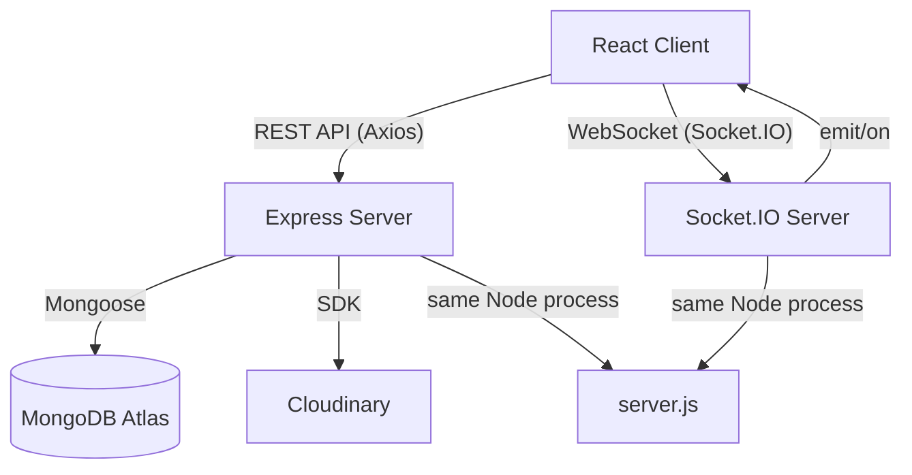

# 💬 Real-Time Chat App — Full Portfolio Write-Up

A full-stack, real-time chat application built with the MERN stack and Socket.IO. Users can register, log in, update their profile, search other users, and exchange text messages and images in real time, with live online-presence indicators and unseen message badges.

---

## 🚀 Live Deployment

| Layer | Platform |
|-------|----------|
| Frontend | Vercel (`vercel.json` in `/client`) |
| Backend | Vercel (`vercel.json` in `/server`) |
| Database | MongoDB Atlas |
| Media Storage | Cloudinary |

---

## 🗂️ Project Structure

```
CHAT-APP/
├── client/               # React + Vite (Frontend)
│   ├── src/
│   │   ├── pages/
│   │   │   ├── LoginPage.jsx       # Sign up / Login form
│   │   │   ├── HomePage.jsx        # Main chat layout
│   │   │   └── ProfilePage.jsx     # Edit profile
│   │   ├── components/
│   │   │   ├── Sidebar.jsx         # User list + search
│   │   │   ├── ChatContainer.jsx   # Message thread + input
│   │   │   └── RightSidebar.jsx    # Selected user info + media
│   │   ├── context/
│   │   │   ├── AuthContext.jsx     # Auth state + Socket connect
│   │   │   └── ChatContext.jsx     # Chat state + real-time events
│   │   ├── lib/
│   │   │   └── utils.js            # formatMessageTime helper
│   │   ├── App.jsx                 # Routing + auth guards
│   │   └── main.jsx                # React entry point
│   ├── package.json
│   └── vite.config.js
│
└── server/               # Node.js + Express (Backend)
    ├── controllers/
    │   ├── userController.js       # signup, login, checkAuth, updateProfile
    │   └── messageController.js   # getUsers, getMessages, sendMessage, markSeen
    ├── models/
    │   ├── User.js                 # Mongoose User schema
    │   └── Message.js              # Mongoose Message schema
    ├── routes/
    │   ├── userRoutes.js           # /api/auth/*
    │   └── messageRoutes.js        # /api/messages/*
    ├── middleware/
    │   └── auth.js                 # JWT protectRoute middleware
    ├── lib/
    │   ├── db.js                   # MongoDB connection
    │   ├── cloudinary.js           # Cloudinary SDK config
    │   └── utils.js                # generateToken (JWT)
    ├── server.js                   # Express app + Socket.IO setup
    └── package.json
```

---

## 🛠️ Tech Stack

### Frontend
| Technology | Version | Purpose |
|------------|---------|---------|
| React | 19 | UI framework |
| Vite | 7 | Build tool & dev server |
| React Router DOM | 7 | Client-side routing |
| Tailwind CSS | 4 | Styling |
| Socket.IO Client | 4.8 | Real-time WebSocket connection |
| Axios | 1.x | HTTP API client |
| React Hot Toast | 2.x | Toast notifications |

### Backend
| Technology | Version | Purpose |
|------------|---------|---------|
| Node.js + Express | 5.x | REST API server |
| Socket.IO | 4.8 | WebSocket server |
| Mongoose | 9.x | MongoDB ODM |
| bcryptjs | 3.x | Password hashing |
| jsonwebtoken | 9.x | JWT auth tokens |
| Cloudinary | 2.x | Image upload & storage |
| dotenv | 17.x | Environment variable management |
| nodemon | 3.x | Development hot-reload |

### Database & Cloud
| Service | Purpose |
|---------|---------|
| MongoDB Atlas | Cloud NoSQL database |
| Cloudinary | Profile picture & chat image hosting |
| Vercel | Deployment (both frontend & backend) |

---

## 📐 Architecture & Data Flow



### How Messages Flow
1. **User sends message** → `POST /api/messages/send/:id` with `{ text }` or `{ image: base64 }`  
2. **Server** saves to MongoDB; if `image`, uploads to Cloudinary first  
3. **Socket.IO** emits `newMessage` directly to the receiver's socket (looked up via `userSocketMap`)  
4. **Receiver's React client** appends the message to state if the chat is open, otherwise increments the unseen-messages badge

---

## 🔐 Authentication System

- **Sign up**: collects `fullName`, `email`, `password`, `bio`; hashes password with `bcryptjs`; generates a JWT
- **Login**: verifies email + password hash; returns a JWT
- **Token storage**: saved in `localStorage`, sent on every request via `axios.defaults.headers.common["token"]`
- **Protected routes**: `protectRoute` middleware decodes the JWT and attaches `req.user` to every protected endpoint
- **Auth guard (client)**: `App.jsx` redirects unauthenticated users to `/login`

---

## ⚡ Real-Time Features (Socket.IO)

| Event | Direction | Meaning |
|-------|-----------|---------|
| `connection` | Client → Server | User connects; their `userId` is mapped to a `socket.id` |
| `getOnlineUsers` | Server → All Clients | Broadcasts the current list of online user IDs |
| `newMessage` | Server → Specific Client | Pushes a new message directly to the recipient |
| `disconnect` | Client → Server | User removed from `userSocketMap`; online-users list re-broadcast |

**`userSocketMap`** (in-memory object on the server) maps `userId → socketId`, enabling targeted message delivery without room management.

---

## 🗃️ Database Models

### User
```js
{
  email:      String (unique, required),
  fullName:   String (required),
  password:   String (required, min 6 chars),
  profilePic: String (default: ""),
  bio:        String,
  createdAt / updatedAt  // timestamps
}
```

### Message
```js
{
  senderId:   ObjectId → User,
  receiverId: ObjectId → User,
  text:       String (optional),
  image:      String (Cloudinary URL, optional),
  seen:       Boolean (default: false),
  createdAt / updatedAt  // timestamps
}
```

---

## 📡 REST API Reference

### Auth Routes — `/api/auth`

| Method | Endpoint | Auth | Description |
|--------|----------|------|-------------|
| POST | `/signup` | ❌ | Register new user |
| POST | `/login` | ❌ | Login + get JWT |
| GET | `/check` | ✅ | Verify current session |
| PUT | `/update-profile` | ✅ | Update name, bio, profile pic |

### Message Routes — `/api/messages`

| Method | Endpoint | Auth | Description |
|--------|----------|------|-------------|
| GET | `/users` | ✅ | All users + unseen message counts |
| GET | `/:id` | ✅ | Conversation history with user `:id` |
| POST | `/send/:id` | ✅ | Send a text or image message |
| PUT | `/mark/:id` | ✅ | Mark message `:id` as seen |

---

## 🖥️ Frontend Pages & Components

### Pages
| Page | Route | Description |
|------|-------|-------------|
| `LoginPage` | `/login` | Two-step sign-up (details → bio) or login form |
| `HomePage` | `/` | Responsive 3-column layout: Sidebar / Chat / RightSidebar |
| `ProfilePage` | `/profile` | Edit name, bio, and profile picture |

### Components
| Component | Description |
|-----------|-------------|
| `Sidebar` | Lists all users, shows Online/Offline status, unseen-message badges, and a search input. Re-fetches on `onlineUsers` change. |
| `ChatContainer` | Shows message thread (text + images), scrolls to latest, supports Enter-to-send and image upload via FileReader |
| `RightSidebar` | Shows selected user's profile pic, name, bio, and a gallery of all shared media images |

### Context (Global State)
| Context | State Managed |
|---------|--------------|
| `AuthContext` | `authUser`, `token`, `onlineUsers`, `socket` + `login`, `logout`, `updateProfile` actions |
| `ChatContext` | `messages`, `users`, `selectedUser`, `unseenMessages` + `getUsers`, `getMessages`, `sendMessage` actions |

---

## 🌟 Key Features

- ✅ **JWT Authentication** with `localStorage` persistence
- ✅ **Real-time messaging** via Socket.IO WebSockets
- ✅ **Image messages** — base64 upload → Cloudinary CDN URL
- ✅ **Online presence** — green dot / "Online" label in real time
- ✅ **Unseen message badges** — count shown per user in the sidebar
- ✅ **Mark-as-seen** — messages auto-marked when conversation is opened
- ✅ **Profile management** — update name, bio, and profile photo
- ✅ **Search users** — filter the user list in the sidebar
- ✅ **Responsive layout** — mobile-first: sidebar hides when a chat is open
- ✅ **Toast notifications** — success/error feedback throughout the app
- ✅ **Deployed on Vercel** — both frontend and backend

---

## ⚙️ Environment Variables

### Server (`server/.env`)
```env
MONGODB_URL=<MongoDB Atlas connection string>
JWT_SECRET=<your JWT secret>
CLOUDINARY_CLOUD_NAME=<cloudinary cloud name>
CLOUDINARY_API_KEY=<cloudinary api key>
CLOUDINARY_API_SECRET=<cloudinary api secret>
NODE_ENV=production
PORT=5000
```

### Client (`client/.env`)
```env
VITE_BACKEND_URL=<your deployed server URL>
```

---

## 🚦 How to Run Locally

```bash
# 1. Install server dependencies
cd server
npm install
npm run server      # nodemon server.js on port 5000

# 2. Install client dependencies
cd ../client
npm install
npm run dev         # Vite dev server (usually :5173)
```

---

## 💡 What I Learned / Built

- Integrating **Socket.IO** on both client and server for bi-directional real-time communication
- Managing **in-memory socket maps** (`userSocketMap`) for targeted message delivery
- Uploading **base64 images** from the browser directly to **Cloudinary** via the backend
- Building a **two-step registration flow** in React
- Managing complex **global state** across auth and chat contexts in React 19
- Deploying a **Node.js + Socket.IO app on Vercel** using `vercel.json` routing

---

*Built with React 19, Node.js/Express 5, Socket.IO 4, MongoDB Atlas, Cloudinary, and Vercel.*
